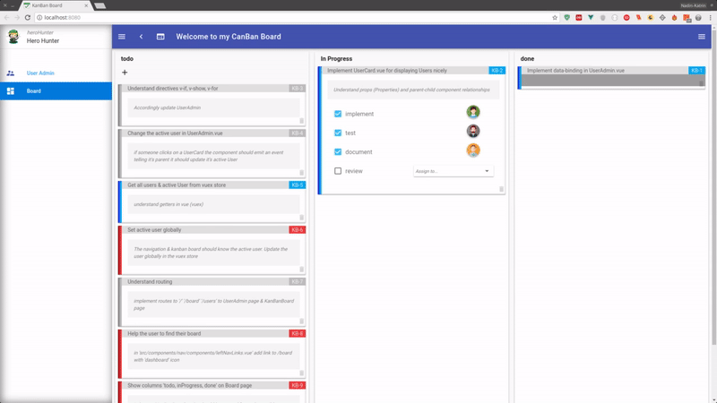

# Exercise 6: _Final Adjustments_
> Here come the final adjustments _(prove what you have learned)_.
>
> You have learned about data-binding, conditionals & loops, components, routing, & the vuex store. Now you are ready to take the final adjustment for getting an awesome working kanban board in Vue.
>
> Now have fun with this tutorial! 😏🖳 

## Setup: Keep up & running

``` bash
# download branch (make sure you are one level above vueTut)
git clone origin/exercise/05_knowledge_transfer git@github.com:na018/vue_basics_tut.git vueTut/02_directives && cd vueTut/05_knowledge_transfer

#prerequisite: node.js is installed
node -v                                      #returns for example v8.2.1

# install dependencies
npm i

#start the json mock server (if it's not running already)
node server.js

# run the application (should open a browser window automatically)
npm start

```
--------------
## todo
in src/store/modules/kanbancards.js:
1. |KB-9| define status type _(e.g. status: ['inProgress', 'done'...])_ 

    used in 'src/components/kanBanComponents/KanBanColumn.vue' defining the columns, 

    in 'src/components/kanBanComponents/KanBanCard.vue' defining the card view & in 'src/store/modules/kanbancards.js' `receiveAllCards()` for Ordering the cards by status
2. |KB-9| implement `getStatus` getter returning the status possibilities of the kanban column & card status types _(e.g. inProgress, done)_

In src/components/pages/KanBanBoard.vue:

3. |KB-9| create 'm-kan-ban-column' for each status defined in the vuex store 'src/store/modules/kanbancards.js

-------------------
## Result _(finshed application 🎉)_



--------------------
## Project Architecture


-------------------

-------------------

### Team
Nadin-Katrin Apel, Alex Schübl, David Bochan
 
 
 Professor: _Prof. Dr. Fridtjof Toenniessen_
-------------------
 
### Further Suggestions
_(Awesome that you kept reading til down here)_

If you made it till here, you hopefully have a working kanban board now. 😏🎉 -

Prove your result here [Finished KanBan Board](https://github.com/na018/vue_basics_tut/tree/origin/exercise/06_finishedApp)

 

 
 
