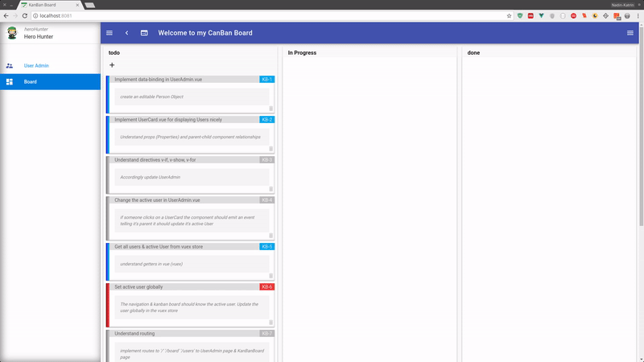

# Exercise 6: _Final Adjustments_
> Yay, you finally made it! 🍹🍻 🍾🎉 _(Or you just want to see the final working kanban board 😏 )_.
>
> In this awesome tutorial series you have learned about data-binding, conditionals & loops, components, routing, & the vuex store. Now you are ready to start working on your own fascinating applications.
>
> _(You could of course as well work out this board to better fit your needs )_😏🖳 

## Setup: Keep up & running

``` bash
# download branch (make sure you are one level above vueTut)
git clone origin/exercise/06_finishedApp git@github.com:na018/vue_basics_tut.git vueTut/02_directives && cd vueTut/06_finishedApp

#prerequisite: node.js is installed
node -v                                      #returns for example v8.2.1

# install dependencies
npm i

#start the json mock server (if it's not running already)
node server.js

# run the application (should open a browser window automatically)
npm start

```
--------------

## Result _(finshed application 🎉)_



--------------------
## Project Architecture

-------------------

-------------------

### Team
Nadin-Katrin Apel, Alex Schübl, David Bochan
 
 
 Professor: _Prof. Dr. Fridtjof Toenniessen_
-------------------
 
### Further Suggestions
_(Awesome that you kept reading til down here)_

If you made it till here, what keeps you from developing your own crazy applications with Vue? 😏🎉 -


 
 
