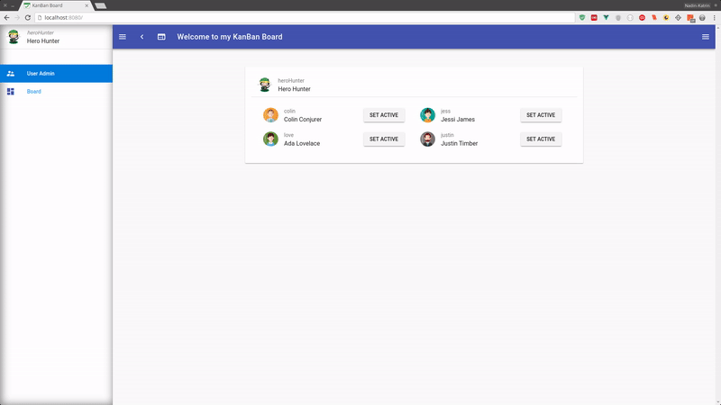

# Exercise 5: _Routing_
> In this exercise you will learn about Routing.
>
> In the last tutorial you learned about the global state management in Vue: _Vuex_.
>
> Now have fun with this tutorial! 😏🖳 

## Setup: Keep up & running

``` bash
# download branch (make sure you are one level above vueTut)
git clone -b origin/exercise/04_routing https://github.com/na018/vue_basics_tut.git vueTut/04_routing && cd vueTut/04_routing

#prerequisite: node.js is installed
node -v                                      #returns for example v8.2.1

# install dependencies
npm i

#start the json mock server (if it's not running already)
node server.js

# run the application (should open a browser window automatically)
npm start

```
--------------
## todo
in src/router/index.js:
1. |KB-7| implement routes to '/' '/board' '/users' to `UserAdmin` page & `KanBanBoard` page

In src/components/nav/components/leftNavLinks.vue:

2. |KB-8| add link to /board with 'dashboard' icon

-------------------
## Result



--------------------
## Project Architecture


-------------------

-------------------

### Team
Nadin-Katrin Apel, Alex Schübl, David Bochan
 
 
 Professor: _Prof. Dr. Fridtjof Toenniessen_
-------------------
 
### Further Suggestions
_(Awesome that you kept reading til down here)_

Now are you ready to take the next challenge? Then what keeps you still waiting? - 

Continue with [Exercise 6: _Final Adjustments_](https://github.com/na018/vue_basics_tut/tree/origin/exercise/05_knowledge_transfer)

 

 
 
