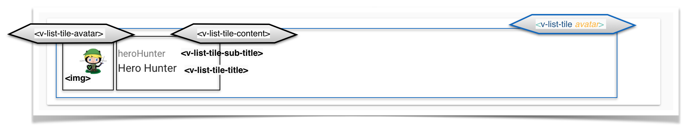

# Exercise 2: _Components in Vue.js_
> In this exercise you will learn about components, parent child relationships: how to pass data from the parent to the child & how to emit events in the child to tell the parent that something has happend
>
> In the last tutorial we learnt about one-way and two-way data binding. 
> One-way data-binding is accomplished with _v-bind_. With the help of this directive the Application data can be easily mapped to an HTML element _(so luckily no traversals through the HTML DOM are necessary for finding the intended element)_
> Two-way data-binding means we additionally listen to an event that could occur and change our application data _(e.g. an input event on a text field)_.
> In vue this may easily accomplished with v-model
>
> Now have fun with this tutorial! 😏🖳 

## Setup: Keep up & running

``` bash
# download branch (make sure you are one level above vueTut)
git clone origin/exercise/01_components git@github.com:na018/vue_basics_tut.git vueTut/00_databinding && cd vueTut/01_components

#prerequisite: node.js is installed
node -v                                      #returns for example v8.2.1

# install dependencies
npm i

#start the json mock server
node server.js

# run the application (should open a browser window automatically)
npm start

```
## todo
In src/components/userAdminComponents/UserCard.vue:
1. |KB-2| implement UserCard with `<v-list-tile-avatar><v-list-tile-content>` as shown in the image below
2. |KB-2| get User Object _onePerson_ from parent component throw the props attribute

in src/components/pages/UserAdmin.vue:
3. |KB-2| use 'src/components/userAdminComponents/UserCard.vue' for displaying one Person by passing the Person object as attribute to `<m-user-card>`


## Result




--------------------
## Project Architecture

-------------------

-------------------

### Team
Nadin-Katrin Apel, Alex Schübl, David Bochan
 
 
 Professor: _Prof. Dr. Fridtjof Toenniessen_
-------------------
 
### Further Suggestions
_(Awesome that you kept reading til down here)_

Now are you ready to take the next challenge? Then what keeps you still waiting? - 

Continue with [Exercise 3: _directives (conditional, loops)_](https://github.com/na018/vue_basics_tut/tree/origin/exercise/02_directives)

 

 
 
