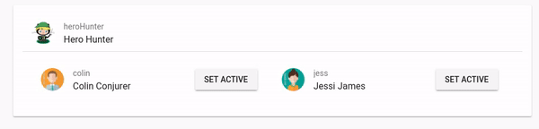

# Exercise 3: _Directives (conditionals, loops)_
> In this exercise you will learn about directives with focus on conditional one _(v-if)_ and loops _(v-for)_
>
> In the last tutorial you learned how to pass data from a parent to a child component. In this tutorial you will reuse the child component in another component to understand the benefits of reusable components.
>
> Additionally you will emit an event from a child component _(this.$emit('functionCalledInParent'))_ to inform the parent component something has happened. _(Here a user has clicked on a card)_.
>
> Now have fun with this tutorial! 😏🖳 

## Setup: Keep up & running

``` bash
# download branch (make sure you are one level above vueTut)
git clone -b origin/exercise/02_directives https://github.com/na018/vue_basics_tut.git vueTut/02_directives && cd vueTut/02_directives

#prerequisite: node.js is installed
node -v                                      #returns for example v8.2.1

# install dependencies
npm i

#start the json mock server
node server.js

# run the application (should open a browser window automatically)
npm start

```
## Result

--------------
## ToDo
In src/components/userAdminComponents/ActivateUser.vue:
1. |KB-3| use 'src/components/userAdminComponents/UserCard.vue' `<m-user-card>` for displaying the user nicely _(reuse the component built in the previous tutorial)_
2. |KB-4| implement the method `setActive()`, which is activated when a user click on the btn. This method should tell the parent component to update it's activeUser

in src/components/pages/UserAdmin.vue:

3. |KB-3| define `activeUser:{}` Object and `allUsers: {}` Object & delete onePerson*
4. |KB-3| loop over `allUsers` and display them in `<m-activate-user>` component
5. |KB-4| `<m-activate-user>` emits the event `changeActiveUser()` the activeUser should be updated, but only if it is not already the active User

-------------------
* hints
```JSON

    activeUser: {
        userName: "heroHunter",
        id: 3,
        firstName: "Hero",
        lastName: "Hunter",
        img: "/static/img/avatars/hero.png",
    },
    allUsers: {
        colin: {
            userName: "colin",
            id: 1,
            firstName: "Colin",
            lastName: "Conjurer",
            img: "/static/img/avatars/avatar-male-1.png",
        },
        jess: {
            userName: "jess",
            id: 2,
            firstName: "Jessi",
            lastName: "James",
            img: "/static/img/avatars/avatar-female-1.png",
        },
        heroHunter: {
            userName: "heroHunter",
            id: 3,
            firstName: "Hero",
            lastName: "Hunter",
            img: "/static/img/avatars/hero.png",
        },
    },

```


--------------------
## Project Architecture


-------------------

-------------------

### Team
Nadin-Katrin Apel, David Bochan, Alex Schübl
 
 
 Professor: _Prof. Dr. Fridtjof Toenniessen_
-------------------
 
### Further Suggestions
_(Awesome that you kept reading til down here)_

Now are you ready to take the next challenge? Then what keeps you still waiting? - 

Continue with [Exercise 4: _Global state management with Vuex_](https://github.com/na018/vue_basics_tut/tree/origin/exercise/03_state_management_vuex)

 

 
 
