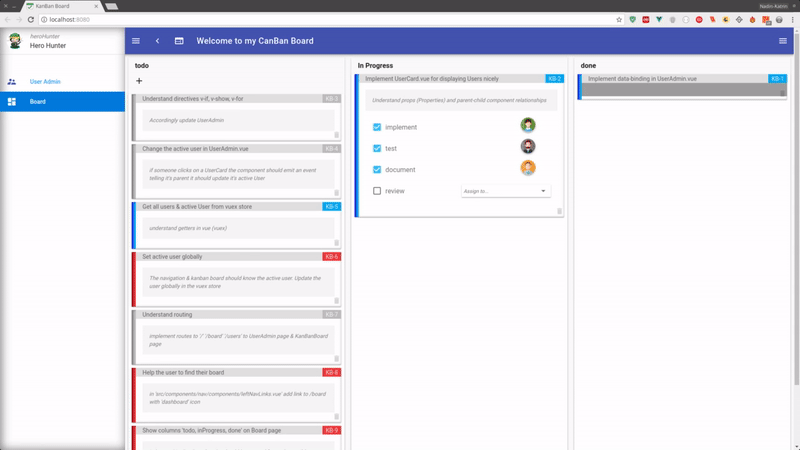
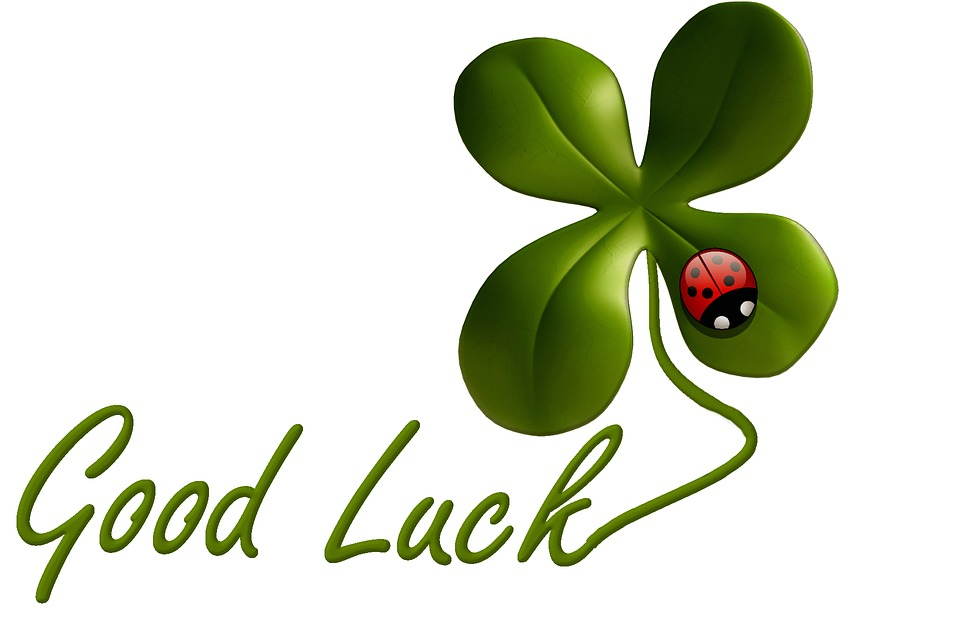

# Vue/ Vuetify tutorial _(in development)_
## This tutorial makes you understand the progressive framework Vue with awesome components from Vuetify
### When successfully completed you are ready to create your own fascinating Web Applications
--------------------

-------------------
> If you want to try out the resulting dashboard you may directly jump to [the tutorial resulting kanban board](https://github.com/na018/vue_basics_tut/tree/origin/exercise/06_finishedApp).
------
### Contens:
> * [Exercise 1: _data bining_](https://github.com/na018/vue_basics_tut/tree/origin/exercise/00_data_binding)
> * [Exercise 2: _component communication_](https://github.com/na018/vue_basics_tut/tree/origin/exercise/01_components)
> * [Exercise 3: _directives (conditional, loops_)](https://github.com/na018/vue_basics_tut/tree/origin/exercise/02_directives)
> * [Exercise 4: _global state management with vuex_](https://github.com/na018/vue_basics_tut/tree/origin/exercise/03_state_management_vuex)
> * [Exercise 5: _routing_](https://github.com/na018/vue_basics_tut/tree/origin/exercise/04_routing)
> * [Exercise 6: _final adjustments_](https://github.com/na018/vue_basics_tut/tree/origin/exercise/05_knowledge_transfer)
------
### Intro
This Project is part of the study subject _Webapplication Development (with focus on web frameworks)_ at the [_Stuttgart Media University_](https://www.hdm-stuttgart.de) in the masters program _Computer Science and Media_ and was realized in summer semester 2018.

The frontend web application was developed with the client-side JavaScript framework [vue.js](https://vuejs.org/) _(^2.5.2)_.
The backend will be realized with the GoLang Framework _Iris_.
For test occasions this tutorial is provided with a JSON mock server that will later be replaced by the GoLang backend application.
In the attached PDF a closer look on both frameworks will be provided. 
It includes:
* Framework choice
* analytical aspects
* further explanations to the exercises

The exercises are chosen wisely trying to improve the comprehension of the main concepts of the frameworks on the one side, while keeping the exercises small and clear on the other side allowing to get a quick basic understanding.
-------------------

### Team
Nadin-Katrin Apel, Alex Schübl, David Bochan
 
 
 Professor: _Prof. Dr. Fridtjof Toenniessen_
-------------------
 
### Further Suggestions
_(Awesome that you kept reading til down here)_

Now are you ready to take the challenge? Then what keeps you still waiting? - Start with [Exercise 1: _data binidng_](https://github.com/na018/vue_basics_tut/tree/origin/exercise/00_data_binding)!
 

 
 