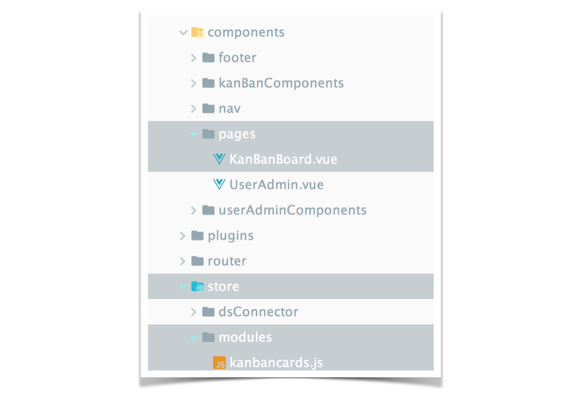

# Exercise 4: _Global state management with Vuex_
> In this exercise you will learn about global state management in Vue: _Vuex_
>
> In the last tutorial you dug deeper into the benefits of reusable components and learned about conditionals and loops in Vue. 
> 
> However there appeared a bug:
>
> The navigation component did not update the active User, however it was changed in there UserAdmin component. The active user will be used in a couple of places in the application _(the later implemented board as well)_. So we need some global state management here :)
>
> Now have fun with this tutorial! 😏🖳 

## Setup: Keep up & running

``` bash
# download branch (make sure you are one level above vueTut)
git clone origin/exercise/03_state_management_vuex git@github.com:na018/vue_basics_tut.git vueTut/02_directives && cd vueTut/03_state_management_vuex

#prerequisite: node.js is installed
node -v                                      #returns for example v8.2.1

# install dependencies
npm i

#start the json mock server (if it's not running already)
node server.js

# run the application (should open a browser window automatically)
npm start

```
--------------
## todo
in src/components/pages/UserAdmin.vue:
1. |KB-5| Use the Getter `allUsers` & `activeUser` from Vuex store _src/store/modules/users.js_ for receiving the global application state

In src/components/userAdminComponents/ActivateUser.vue:
2. |KB-6| update the method `setActive()` by calling the action `setActiveUser()` from _src/store/modules/users.js_ in Vuex store, which passes the user object to the correspondent mutation method, that updated the global state and with that updates the user in `leftNav.vue`.

-------------------
## Result


--------------------
## Project Architecture


-------------------

-------------------

### Team
Nadin-Katrin Apel, Alex Schübl, David Bochan
 
 
 Professor: _Prof. Dr. Fridtjof Toenniessen_
-------------------
 
### Further Suggestions
_(Awesome that you kept reading til down here)_

Now are you ready to take the next challenge? Then what keeps you still waiting? - 

Continue with [Exercise 5: _Routing_](https://github.com/na018/vue_basics_tut/tree/origin/exercise/04_routing)

 

 
 
